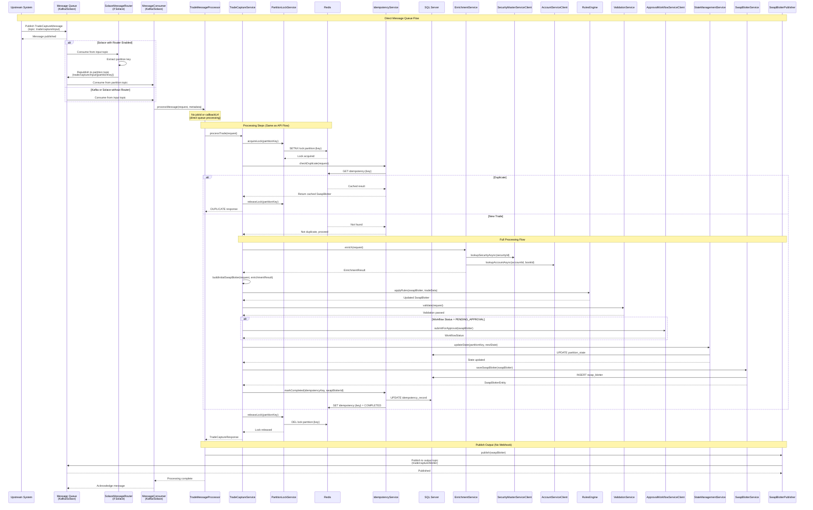
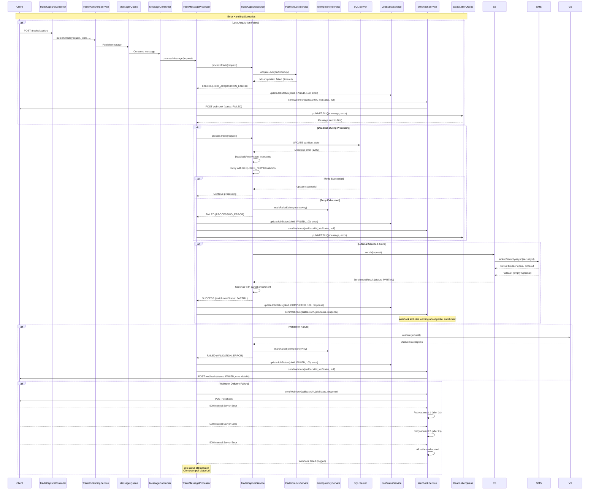
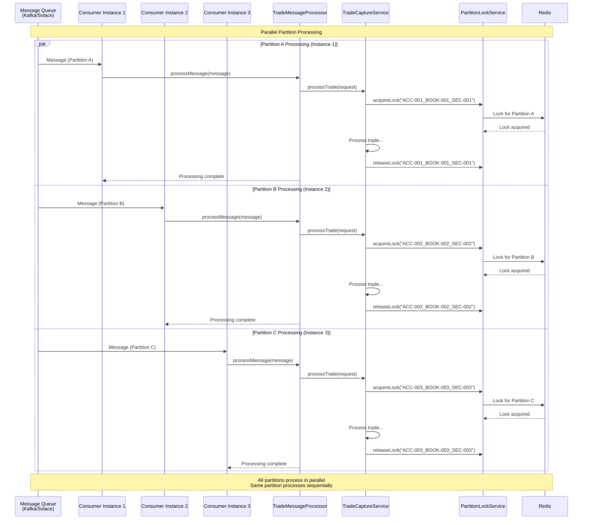
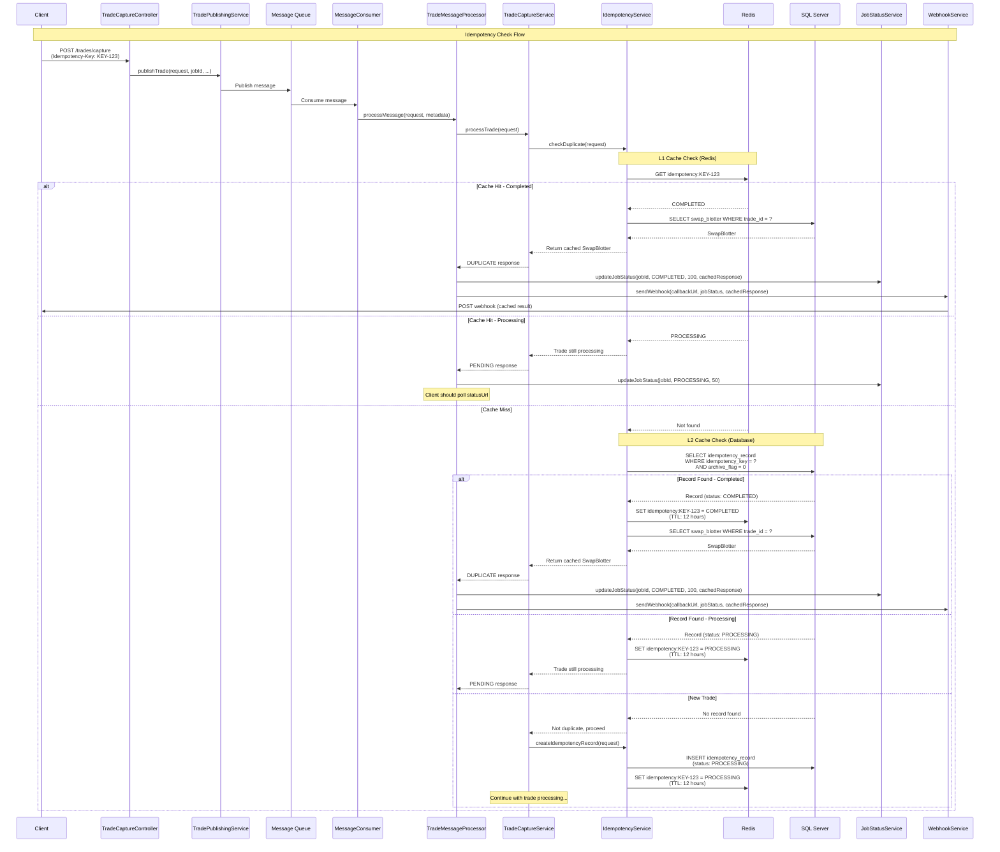
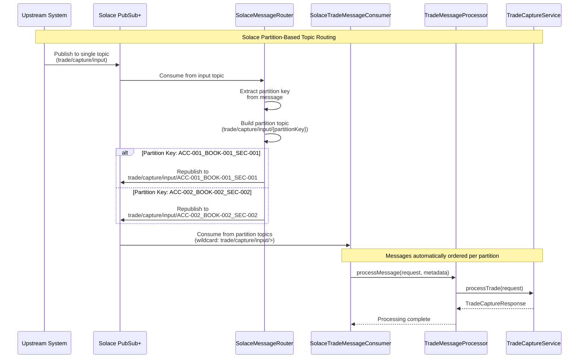

# Trade Capture Service - End-to-End Sequence Diagram

## Overview

This document provides comprehensive sequence diagrams showing the complete end-to-end flow of the Trade Capture Service, including:
- **Async API Flow**: REST API → Message Queue → Processing → Webhook Callback
- **Message Queue Flow**: Direct message consumption from Kafka/Solace
- **Error Handling**: Retry, deadlock handling, and DLQ
- **Parallel Processing**: Multiple partitions processing concurrently

## Async API Flow (REST API with Webhook Callback)

This is the primary flow when clients submit trades via REST API with a callback URL.

```mermaid
sequenceDiagram
    participant Client
    participant API as TradeCaptureController
    participant JSS as JobStatusService
    participant TPS as TradePublishingService
    participant MQ as Message Queue<br/>(Kafka/Solace)
    participant Consumer as MessageConsumer<br/>(Kafka/Solace)
    participant TMP as TradeMessageProcessor
    participant TCS as TradeCaptureService
    participant PLS as PartitionLockService
    participant Redis
    participant IS as IdempotencyService
    participant DB as SQL Server
    participant ES as EnrichmentService
    participant SMS as SecurityMasterServiceClient
    participant ASC as AccountServiceClient
    participant RE as RulesEngine
    participant VS as ValidationService
    participant AWS as ApprovalWorkflowServiceClient
    participant SMSvc as StateManagementService
    participant SBS as SwapBlotterService
    participant WS as WebhookService
    participant Callback as Client Webhook<br/>Endpoint

    Note over Client,Callback: Async API Flow with Webhook Callback

    Client->>API: POST /api/v1/trades/capture<br/>Headers: X-Callback-Url<br/>Body: TradeCaptureRequest
    API->>JSS: createJob(null, tradeId, "REST_API")
    JSS->>DB: INSERT job_status<br/>(status: PENDING)
    DB-->>JSS: Job created
    JSS-->>API: jobId: "abc-123"
    
    API->>TPS: publishTrade(request, jobId, "REST_API", callbackUrl)
    TPS->>TPS: Convert to Protobuf<br/>Add metadata: job_id, callback_url, source_api
    TPS->>MQ: Publish to queue<br/>(topic: trade/capture/input)
    MQ-->>TPS: Message published
    TPS-->>API: Published successfully
    
    API-->>Client: 202 Accepted<br/>{jobId, status: "ACCEPTED", statusUrl}
    
    Note over MQ,Callback: Async Processing (Background)
    
    MQ->>Consumer: Consume message
    Consumer->>TMP: processMessage(request, metadata)
    
    Note over TMP,Redis: Step 1: Job Status Update
    TMP->>JSS: updateJobStatus(jobId, PROCESSING, 50)
    JSS->>DB: UPDATE job_status<br/>(status: PROCESSING, progress: 50)
    DB-->>JSS: Updated
    JSS-->>TMP: Status updated
    
    Note over TMP,Redis: Step 2: Partition Locking
    TMP->>TCS: processTrade(request)
    TCS->>PLS: acquireLock(partitionKey)
    PLS->>Redis: SETNX lock:partition:{key}
    Redis-->>PLS: Lock acquired
    PLS-->>TCS: Lock acquired
    
    Note over TCS,DB: Step 3: Idempotency Check
    TCS->>IS: checkDuplicate(request)
    IS->>Redis: GET idempotency:{key}
    alt Cache Hit - Completed
        Redis-->>IS: Cached result (COMPLETED)
        IS->>DB: SELECT swap_blotter WHERE trade_id = ?
        DB-->>IS: SwapBlotter
        IS-->>TCS: Return cached SwapBlotter
        TCS->>PLS: releaseLock(partitionKey)
        TCS-->>TMP: DUPLICATE response
        TMP->>JSS: updateJobStatus(jobId, COMPLETED, 100)
        TMP->>WS: sendWebhook(callbackUrl, jobStatus, response)
        WS->>Callback: POST webhook payload<br/>(status: COMPLETED, cached result)
        Callback-->>WS: 200 OK
        WS-->>TMP: Webhook sent
        TMP-->>Consumer: Processing complete
    else Cache Miss - New Trade
        Redis-->>IS: Not found
        IS->>DB: SELECT idempotency_record WHERE key = ?
        DB-->>IS: No record
        IS-->>TCS: Not duplicate, proceed
    end
    
    Note over TCS,DB: Step 4: Create Idempotency Record
    TCS->>IS: createIdempotencyRecord(request)
    IS->>DB: INSERT idempotency_record<br/>(status: PROCESSING)
    DB-->>IS: Record created
    IS->>Redis: SET idempotency:{key} = PROCESSING<br/>(TTL: 12 hours)
    Redis-->>IS: Cached
    IS-->>TCS: Record created
    
    Note over TCS,ASC: Step 5: Parallel Enrichment
    par Parallel Enrichment
        TCS->>ES: enrich(request)
        ES->>SMS: lookupSecurityAsync(securityId)
        SMS->>SMS: Mock/Real Service Call<br/>(with circuit breaker)
        SMS-->>ES: Security data
    and
        ES->>ASC: lookupAccountAsync(accountId, bookId)
        ASC->>ASC: Mock/Real Service Call<br/>(with circuit breaker)
        ASC-->>ES: Account data
    end
    ES-->>TCS: EnrichmentResult<br/>(status, enrichedData)
    
    Note over TCS,RE: Step 6: Build Initial SwapBlotter
    TCS->>TCS: buildInitialSwapBlotter(request, enrichmentResult)
    TCS->>TCS: SwapBlotter created<br/>(enrichmentStatus, workflowStatus: PENDING_APPROVAL)
    
    Note over TCS,RE: Step 7: Apply Rules
    TCS->>RE: applyRules(swapBlotter, tradeData)
    RE->>RE: Evaluate Economic Rules
    RE->>RE: Evaluate Non-Economic Rules
    RE->>RE: Evaluate Workflow Rules
    RE-->>TCS: Updated SwapBlotter<br/>(rulesApplied tracked)
    
    Note over TCS,VS: Step 8: Validation
    TCS->>VS: validate(request)
    VS->>VS: Validate ISIN, Account Status, etc.
    VS-->>TCS: Validation passed
    
    Note over TCS,AWS: Step 9: Approval Workflow
    alt Workflow Status = PENDING_APPROVAL
        TCS->>AWS: submitForApproval(swapBlotter)
        AWS->>AWS: Mock/Real Approval Service
        AWS-->>TCS: WorkflowStatus (APPROVED/REJECTED/PENDING)
        
        alt Rejected
            TCS->>IS: markFailed(idempotencyKey)
            TCS->>PLS: releaseLock(partitionKey)
            TCS-->>TMP: REJECTED response
            TMP->>JSS: updateJobStatus(jobId, FAILED, 100)
            TMP->>WS: sendWebhook(callbackUrl, jobStatus, null)
            WS->>Callback: POST webhook payload<br/>(status: FAILED, error)
            Callback-->>WS: 200 OK
        else Approved
            Note over TCS: Continue to Step 10
        end
    end
    
    Note over TCS,DB: Step 10: State Management
    TCS->>SMSvc: updateState(partitionKey, newState)
    SMSvc->>DB: SELECT partition_state<br/>WHERE partition_key = ?<br/>(PESSIMISTIC_WRITE lock)
    DB-->>SMSvc: Current state
    SMSvc->>SMSvc: Validate state transition
    SMSvc->>DB: UPDATE partition_state<br/>(positionState, stateJson, version++)
    DB-->>SMSvc: State updated
    SMSvc-->>TCS: State updated
    
    Note over TCS,DB: Step 11: Save SwapBlotter
    TCS->>SBS: saveSwapBlotter(swapBlotter)
    SBS->>DB: INSERT swap_blotter<br/>(tradeId, partitionKey, swapBlotterJson)
    DB-->>SBS: Blotter saved
    SBS-->>TCS: SwapBlotterEntity
    
    Note over TCS,DB: Step 12: Update Idempotency Record
    TCS->>IS: markCompleted(idempotencyKey, swapBlotterId)
    IS->>DB: UPDATE idempotency_record<br/>(status: COMPLETED, swapBlotterId)
    DB-->>IS: Record updated
    IS->>Redis: SET idempotency:{key} = COMPLETED<br/>(TTL: 12 hours)
    Redis-->>IS: Cached
    IS-->>TCS: Marked completed
    
    Note over TCS,Redis: Step 13: Release Lock
    TCS->>PLS: releaseLock(partitionKey)
    PLS->>Redis: DEL lock:partition:{key}
    Redis-->>PLS: Lock released
    PLS-->>TCS: Lock released
    
    Note over TMP,Callback: Step 14: Update Job Status & Send Webhook
    TCS-->>TMP: TradeCaptureResponse<br/>(status: SUCCESS, swapBlotter)
    TMP->>JSS: updateJobStatus(jobId, COMPLETED, 100, response)
    JSS->>DB: UPDATE job_status<br/>(status: COMPLETED, result: response)
    DB-->>JSS: Updated
    JSS-->>TMP: Status updated
    
    TMP->>WS: sendWebhook(callbackUrl, jobStatus, response)
    WS->>WS: Build webhook payload<br/>(jobId, status, tradeId, swapBlotter)
    WS->>Callback: POST https://client.com/webhooks/trade-complete<br/>Payload: {jobId, status: "COMPLETED", swapBlotter, ...}
    alt Webhook Success
        Callback-->>WS: 200 OK
        WS-->>TMP: Webhook sent successfully
    else Webhook Failure
        Callback-->>WS: 500 Internal Server Error
        WS->>WS: Retry with exponential backoff<br/>(up to 3 attempts)
        alt Retry Successful
            Callback-->>WS: 200 OK
            WS-->>TMP: Webhook sent (after retry)
        else All Retries Failed
            WS-->>TMP: Webhook failed (logged, job still completed)
        end
    end
    
    TMP-->>Consumer: Processing complete
    Consumer-->>MQ: Acknowledge message
    
    Note over Client,Callback: Client receives webhook notification<br/>Can also poll statusUrl for job status
```



## Direct Message Queue Flow (No API Call)

This flow occurs when trades are published directly to the message queue (e.g., from upstream systems).



## Error Handling Flow



## Parallel Processing Flow



## Idempotency Flow



## Solace Partition Routing Flow



## Components Legend

### Controllers & API
- **TradeCaptureController**: REST API endpoint handler
- **ManualEntryController**: Manual trade entry endpoint
- **FileUploadController**: Batch file upload endpoint

### Services
- **TradeCaptureService**: Main orchestration service
- **TradePublishingService**: Publishes trades to message queue
- **TradeMessageProcessor**: Processes messages from queue
- **JobStatusService**: Tracks async job status
- **WebhookService**: Sends webhook callbacks
- **PartitionLockService**: Distributed locking using Redis/Hazelcast
- **IdempotencyService**: Duplicate detection and caching
- **EnrichmentService**: Parallel enrichment orchestration
- **SecurityMasterServiceClient**: Security data lookup (with circuit breaker)
- **AccountServiceClient**: Account/Book data lookup (with circuit breaker)
- **RulesEngine**: Rule evaluation and application
- **ValidationService**: Trade validation
- **ApprovalWorkflowServiceClient**: Approval workflow integration
- **StateManagementService**: CDM-compliant state management
- **SwapBlotterService**: Blotter persistence

### Messaging
- **TradeInputPublisher**: Interface for publishing trades (Kafka/Solace)
- **TradeInputPublisherFactory**: Factory for getting configured publisher
- **SolaceMessageRouter**: Routes messages to partition-specific topics
- **SwapBlotterPublisher**: Publishes processed blotters to output queue

### Infrastructure
- **Redis/Hazelcast**: Distributed locking and idempotency cache (L1)
- **SQL Server**: Persistent storage (idempotency records, swap blotter, partition state, job status)
- **Kafka/Solace**: Message queues for trade input and blotter output
- **DeadLetterQueue**: Failed message handling

## Key Design Patterns

1. **Async Processing**: All API requests are queued for async processing
2. **Webhook Callbacks**: Clients receive notifications via HTTP POST to callback URL
3. **Job Status Tracking**: Jobs tracked in database with status polling endpoint
4. **Partition-Based Processing**: Trades partitioned by `{accountId}_{bookId}_{securityId}`
5. **Distributed Locking**: Redis/Hazelcast-based locks ensure sequential processing per partition
6. **Two-Level Caching**: Redis (L1) + Database (L2) for idempotency checks
7. **Parallel Enrichment**: Concurrent calls to SecurityMaster and AccountService
8. **Circuit Breaker Pattern**: Resilience4j for external service calls
9. **Deadlock Retry**: Automatic retry with `REQUIRES_NEW` transactions
10. **Idempotency**: Prevents duplicate processing via idempotency keys
11. **Approval Workflow**: Conditional approval for manual trades
12. **State Management**: CDM-compliant state transitions with optimistic locking
13. **Solace Partition Routing**: Internal routing to partition-specific topics for ordering

## Webhook Payload Structure

```json
{
  "jobId": "abc-123-def-456",
  "status": "COMPLETED",
  "progress": 100,
  "message": "Trade processing completed",
  "createdAt": "2024-01-15T10:30:00Z",
  "updatedAt": "2024-01-15T10:30:05Z",
  "tradeId": "TRADE-2024-001",
  "tradeStatus": "SUCCESS",
  "swapBlotter": {
    "tradeId": "TRADE-2024-001",
    "partitionKey": "ACC-001_BOOK-001_US0378331005",
    "enrichmentStatus": "COMPLETE",
    "workflowStatus": "APPROVED",
    "state": {
      "positionState": "FORMED"
    }
  },
  "error": null
}
```

## Performance Characteristics

- **API Response Time**: < 50ms (202 Accepted returned immediately)
- **Processing Latency**: P95 < 2 seconds (end-to-end processing)
- **Throughput**: 10-20 trades/sec per instance (sustained)
- **Burst Capacity**: 100-150 trades/sec (with optimizations)
- **Parallel Processing**: Multiple partitions process concurrently
- **Webhook Retry**: 3 attempts with exponential backoff (1s, 2s)
- **Webhook Timeout**: 30 seconds (configurable)
- **Connection Pool**: 50 connections (configurable)
- **Lock Timeout**: 30 seconds (configurable)

## Notes

- All API requests return **202 Accepted** immediately with a `jobId`
- Clients receive completion notifications via **webhook callbacks** to `X-Callback-Url`
- Clients can also **poll** the `/api/v1/trades/jobs/{jobId}/status` endpoint as fallback
- Webhook failures are retried but don't fail the job (job status still updated)
- All external service calls use circuit breakers, retries, and time limiters
- Deadlock retry uses `REQUIRES_NEW` propagation to isolate retries
- Idempotency records have TTL (24 hours in DB, 12 hours in Redis)
- Partition locks are automatically released after processing
- Failed messages are published to DLQ for manual review
- Mock services can be enabled via configuration for testing
- Solace partition routing enables automatic ordering per partition key

## Related Documentation

- [Callback URL Usage Guide](./callback-url-usage-guide.md)
- [API Documentation](./api/trade-capture-service-openapi.yaml)
- [Trade Capture Service Design](./trade-capture-service_design.md)
- [Solace Integration](./solace-partition-routing-implementation.md)
