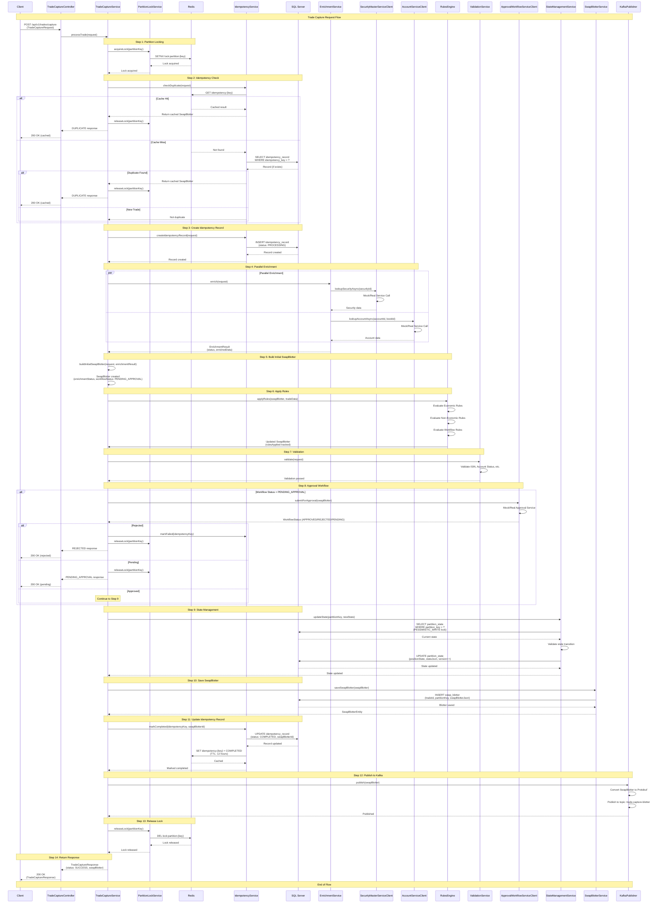
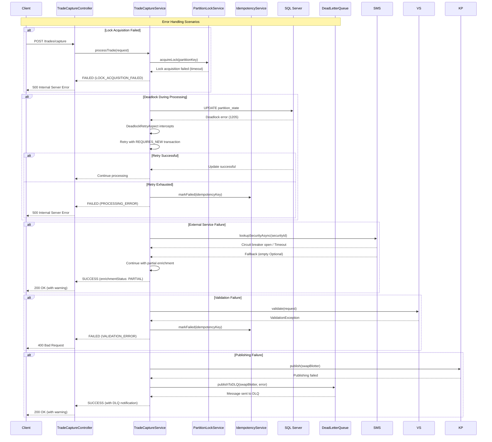
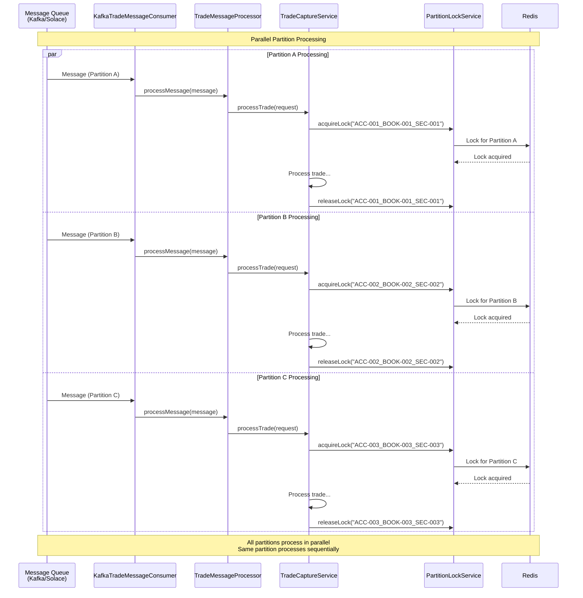
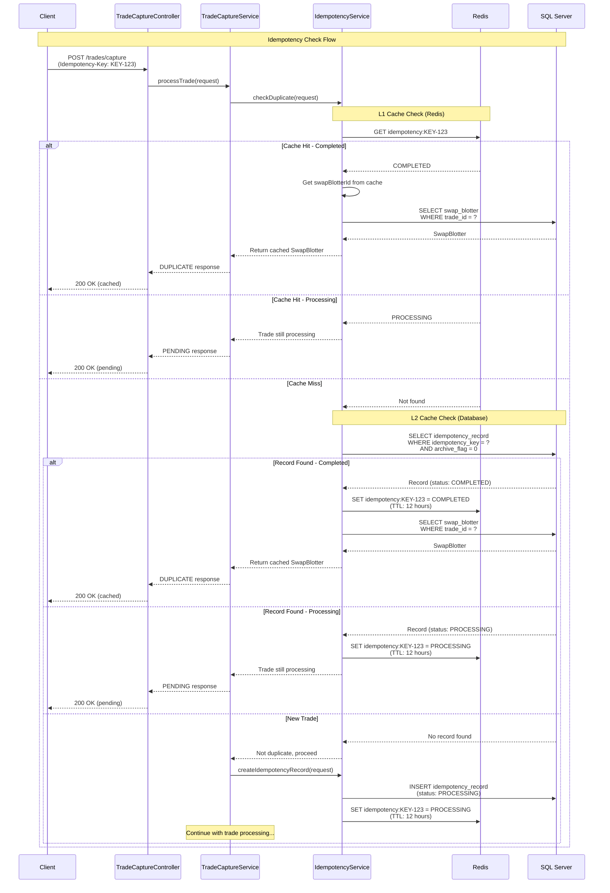
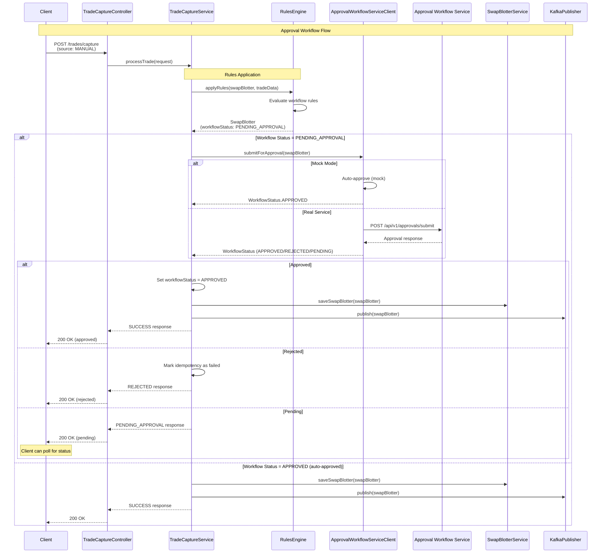

# Trade Capture Service - End-to-End Sequence Diagram

## Overview

This document provides a comprehensive sequence diagram showing the complete end-to-end flow of the Trade Capture Service, from initial trade request through enrichment, rules application, approval workflow, and final blotter publication.

## Complete Flow Sequence Diagram

## Error Handling Flow

## Parallel Processing Flow

## Idempotency Flow

## Approval Workflow Sequence

## Components Legend

### Services
- **TradeCaptureController**: REST API endpoint handler
- **TradeCaptureService**: Main orchestration service
- **PartitionLockService**: Distributed locking using Redis
- **IdempotencyService**: Duplicate detection and caching
- **EnrichmentService**: Parallel enrichment orchestration
- **SecurityMasterServiceClient**: Security data lookup (with circuit breaker)
- **AccountServiceClient**: Account/Book data lookup (with circuit breaker)
- **RulesEngine**: Rule evaluation and application
- **ValidationService**: Trade validation
- **ApprovalWorkflowServiceClient**: Approval workflow integration
- **StateManagementService**: CDM-compliant state management
- **SwapBlotterService**: Blotter persistence
- **KafkaPublisher**: Message publishing to Kafka

### Infrastructure
- **Redis**: Distributed locking and idempotency cache (L1)
- **SQL Server**: Persistent storage (idempotency records, swap blotter, partition state)
- **Kafka**: Message queue for blotter publishing
- **DeadLetterQueue**: Failed message handling

## Key Design Patterns

1. **Partition-Based Processing**: Trades partitioned by `{accountId}_{bookId}_{securityId}`
2. **Distributed Locking**: Redis-based locks ensure sequential processing per partition
3. **Two-Level Caching**: Redis (L1) + Database (L2) for idempotency checks
4. **Parallel Enrichment**: Concurrent calls to SecurityMaster and AccountService
5. **Circuit Breaker Pattern**: Resilience4j for external service calls
6. **Deadlock Retry**: Automatic retry with `REQUIRES_NEW` transactions
7. **Idempotency**: Prevents duplicate processing via idempotency keys
8. **Approval Workflow**: Conditional approval for manual trades
9. **State Management**: CDM-compliant state transitions with optimistic locking

## Performance Characteristics

- **Latency**: P95 < 50ms (under normal load)
- **Throughput**: 10-20 trades/sec per instance (sustained)
- **Burst Capacity**: 100-150 trades/sec (with optimizations)
- **Parallel Processing**: Multiple partitions process concurrently
- **Connection Pool**: 50 connections (configurable)
- **Lock Timeout**: 30 seconds (configurable)

## Notes

- All external service calls use circuit breakers, retries, and time limiters
- Deadlock retry uses `REQUIRES_NEW` propagation to isolate retries
- Idempotency records have TTL (24 hours in DB, 12 hours in Redis)
- Partition locks are automatically released after processing
- Failed messages are published to DLQ for manual review
- Mock services can be enabled via configuration for testing

